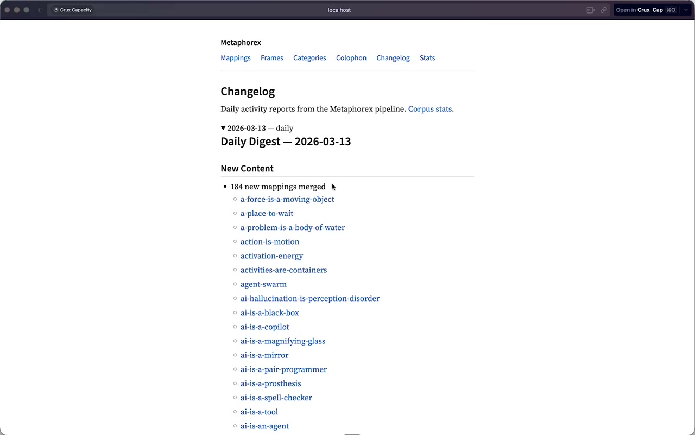
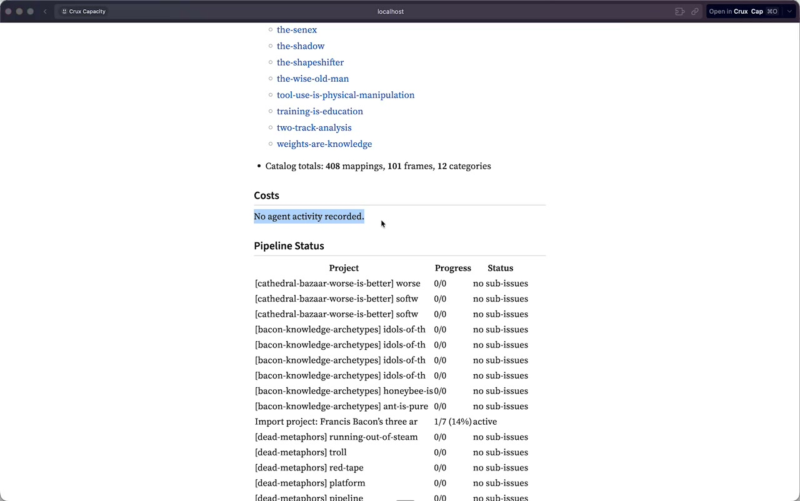
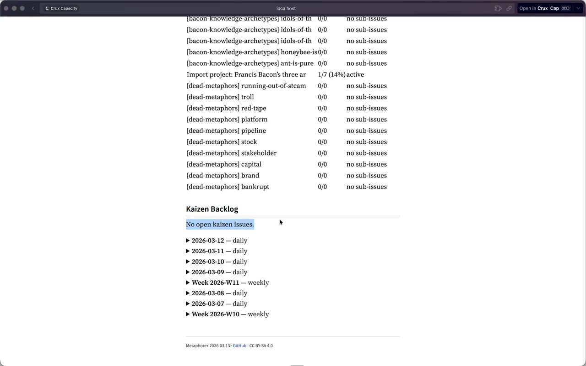

# Screen Feedback — Changelog & Digest Review

**Date:** 2026-03-13 14:23
**Source:** `CleanShot 2026-03-13 at 14.23.34.mp4`

## Issues

### 1. "New mappings merged" language is too PR-centric (minor)

**Timestamp:** 00:17 - 00:37

The daily digest says "184 new mappings merged" with a list of slugs. The word "merged" exposes internal PR mechanics that don't belong in a public-facing changelog. Should say "added" or "new entries" instead. The slug list itself is also overwhelming at 184 items — needs a summary count with maybe top-5, not an exhaustive list.

---

### 2. Cost tracking returns nothing — "No agent activity recorded" (major)

**Timestamp:** 00:37 - 00:50

The Costs section shows "No agent activity recorded" even though agents have been actively running. The `stats_from_issues()` function parses `## stats:` comment lines from import-project issues, but either (a) agents aren't posting stats comments in the expected format, or (b) the date filter is too narrow, or (c) the comment parsing regex doesn't match actual comment format. This is the section the user considers most valuable — it needs to work.

---

### 3. Pipeline Status table is noisy and unhelpful (major)

**Timestamp:** 00:52 - 01:04

The Pipeline Status table lists every sub-issue of every import project individually, resulting in a huge table of mostly "0/0 no sub-issues" rows. Titles are truncated. The user wants one row per import project with aggregate progress, not per-sub-issue rows. Should show only import-project level: "Jungian Archetypes: 6/7 (86%)" not 20 rows of individual sub-issue slugs.

---

### 4. Same mapping appears across multiple daily digests (major)

**Timestamp:** 01:27 - 01:50

"a-place-to-wait" shows up on the Mar 13, Mar 12, and Mar 10 digests. The `merged_prs()` query uses `merged:since..until` which should scope to a single day, but if the PR was edited/touched across days (or the search query is matching edits, not just merges), entries repeat. User wants each entry to appear only on the day it was first added, not on every day it was touched.

---

### 5. No open kaizen issues — expected but confusing (minor)

**Timestamp:** 01:04 - 01:22

"No open kaizen issues" is correct — the kaizen template was just created in this session. But the user expected to see friction items that were previously tracked elsewhere. Not a bug, but the empty state message could link to the template: "No open kaizen issues. [File one](link)."

---

### 6. Digest lacks at-a-glance value — no trend data (major)

**Timestamp:** 01:50 - 02:30

The user's core frustration: "at a glance I want to see whether our rate is stabilizing, is increasing, where it's all coming from." The current digest is a flat snapshot — it has no comparison to previous days/weeks, no growth rate, no delta. A useful daily digest would show "+12 mappings today (vs +8 yesterday)" or "Week 11: 184 added, up from 92 in Week 10." Without deltas, the digest doesn't answer the question it exists to answer.

---

## Summary

- 6 issues found (0 critical, 4 major, 2 minor)
- Core theme: the digest generates data but doesn't synthesize it into insight
- Top priorities: fix cost tracking (#2), simplify pipeline status (#3), add trend deltas (#6)
- Quick wins: rename "merged" to "added" (#1), improve empty states (#5)
